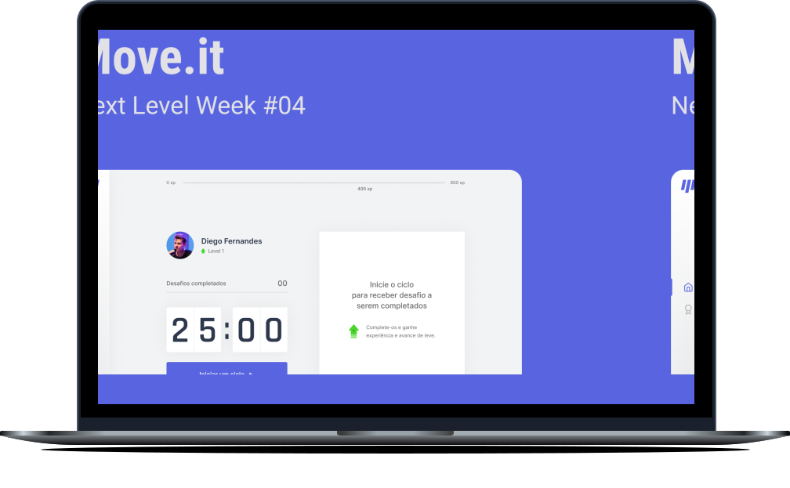

<h1 align="center">
  
</h1>

<p align="center">This project was developed during the <strong><a href="https://nextlevelweek.com/">Next Level Week #4</a></strong> offered by <strong><a href="https://github.com/Rocketseat">@Rocketseat</a></strong></p>

<p align="center">During February 22-28, 2021</p> <br>

<p align="center">
  <a href="#-about">About</a>&nbsp;&nbsp;&nbsp;|&nbsp;&nbsp;&nbsp;
  <a href="#-technologies">Technologies</a>&nbsp;&nbsp;&nbsp;|&nbsp;&nbsp;&nbsp;
  <a href="#-preview">Preview</a>&nbsp;&nbsp;&nbsp;|&nbsp;&nbsp;&nbsp;
  <a href="#-getting-started">Getting Started</a>&nbsp;&nbsp;&nbsp;|&nbsp;&nbsp;&nbsp;
  <a href="#-layout">Layout</a>&nbsp;&nbsp;&nbsp;|&nbsp;&nbsp;&nbsp;
  <a href="#-license">License</a>
</p>

<p align="center">
  
  
  <a href="https://github.com/frankjrp/RocketSeat-NLW-4/commits/main">
    
  </a>
</p>

<p align="center">
  
</p>

## 🔖 About
The project **Move.it** was developed to remind you to exercise regularly.

## 🛠 Technologies
This project was developed using the following technologies:

- [React](https://reactjs.org/)
- [Next.js](https://nextjs.org/)
- [TypeScript](https://www.typescriptlang.org/)

## 💻 Preview
[](https://moveit-frankjrp.vercel.app/)

## 🚀 Getting Started
Clone the project and access the folder

```bash
$ git clone https://github.com/frankjrp/RocketSeat-NLW-4.git && cd Moveit-next
```
Follow the steps below

```bash
# Install the dependencies
$ yarn install

# Start the project
$ yarn dev

# The project will be available on port 3000 <http://localhost:3000>
```
## 🎨 Layout
You can view the project layout through the link below:

- [Layout Web 1.0](https://www.figma.com/file/ge20pu3ofMOKoliUyKx1Nl/Move.it-1.0)

Remembering that you need to have a [Figma](http://figma.com/) account to access it.

## 📝 License
This project is licensed under the MIT License. See the [LICENSE](LICENSE) file for details.
